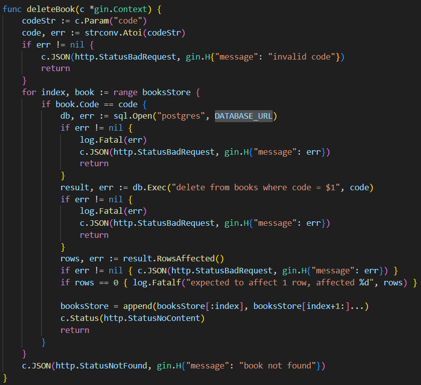

Программирование корпоративных систем

Фадеев Максим

Практика 10

Подключение к базе происходит в каждом запросе, для этого используется DATABASE_URL

Переписываем все функции Теперь отправляем sql запрос на postgers

Данные в postgres
